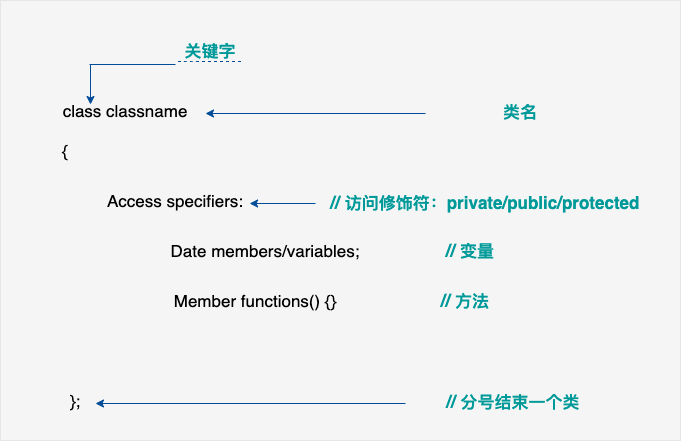
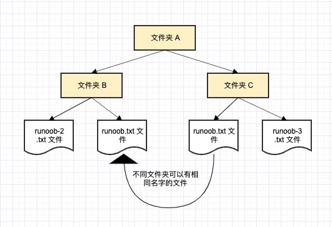

# 类
```
 基本和java一样
```

例子
```c++
#include<iostream>
#include<string>
using namespace std;

class Box
{
private:
    int height;
    int width;
    string name;

public:
    Box(string name, int w,int h);
    ~Box();
    void setWidth(int w);
    string String();
};

Box::Box(string name, int w, int h)
{
    this->name = name;
    this->width = w;
    this->height=h;
}

Box::~Box()
{
    cout<<"释放Box";
}

void Box::setWidth(int w){
    this->width = w ;
}

string Box::String() {
    return "名字："+this->name + ",宽:" +to_string(this->width) +",高:"+ to_string(this->height);
}

int main(){
    Box b("sdfds",1,3);
    string str = b.String();
    cout<<str<<endl;
    return 1;
}
```
## 函数重载
```
当方法名相同，参数个数、顺序或类型不同时(但不能通过返回值)
和java一样
```
## 运算重载 

```
大概的概念指的是两个相同的对象可以运算(相加，相减等)
```
[具体可以查看](https://www.runoob.com/cplusplus/cpp-overloading.html)
# 虚函数
注意区分有两种
1.虚函数 相当于java的父类方法，要求必须实现，哪怕是空实现
2.纯虚函数 相当于java的接口，用=0表示，要求子类必须实现
## 虚函数
```
virtual int getAre(){};
```
## 纯虚函数
```
virtual int getAre()=0;
```
# 异常
差不多和java一样，没有finally关键字
但实际中好像很少使用exception
```c++
void aa(){
    throw "this is exception";
}
int main(){
    try {
        aa();
    } catch(exception e){

    }
}
```
# new关键字
c++也区分堆内存和栈内存
object b = new object(); 是分配到堆内存，用完后要用delete b 释放掉;
如果自由空间(堆内存)使用完了，那么new object也可能失败，建议检查
```c++
double *b = NULL;
if (!(b = new double)) {
    cout<<"out of memory!"<<endl;
    exit(1);
}
```
# namespace 命名空间
主要解决 名字冲突问题，例如 不同文件目录下可以有相同的文件名

## 同级别多个命名空间
```c++
#include <iostream>
using namespace std;

namespace first_space{
   void func(){
      cout << "Inside first_space" << endl;
   }
}
namespace second_space{
   void func(){
      cout << "Inside second_space" << endl;
   }
}
int main ()
{
   first_space::func();//调用第一个命名空间
   second_space::func(); //调用第二个命名空间
   return 0;
}
```
## 嵌套命名空间
```c++
namespace namespace_name1 {
   // 代码声明
   namespace namespace_name2 {
      // 代码声明
   }
}
```