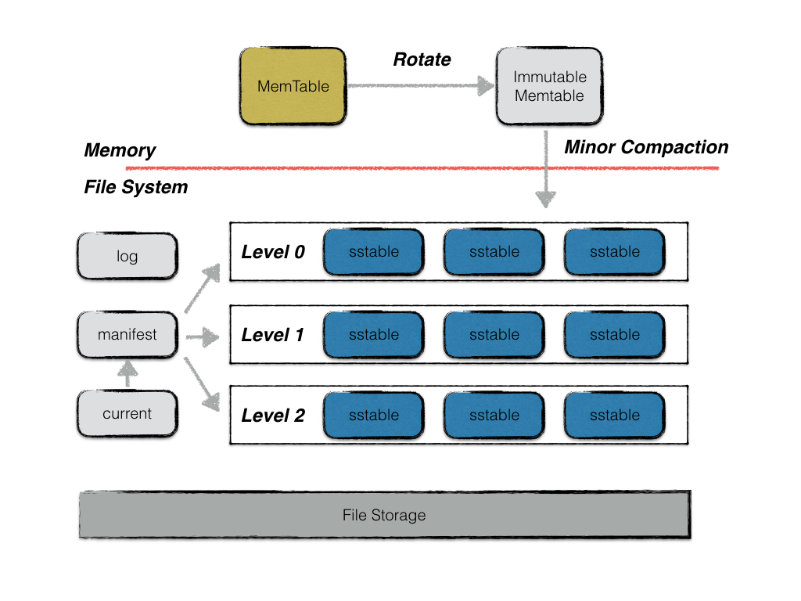
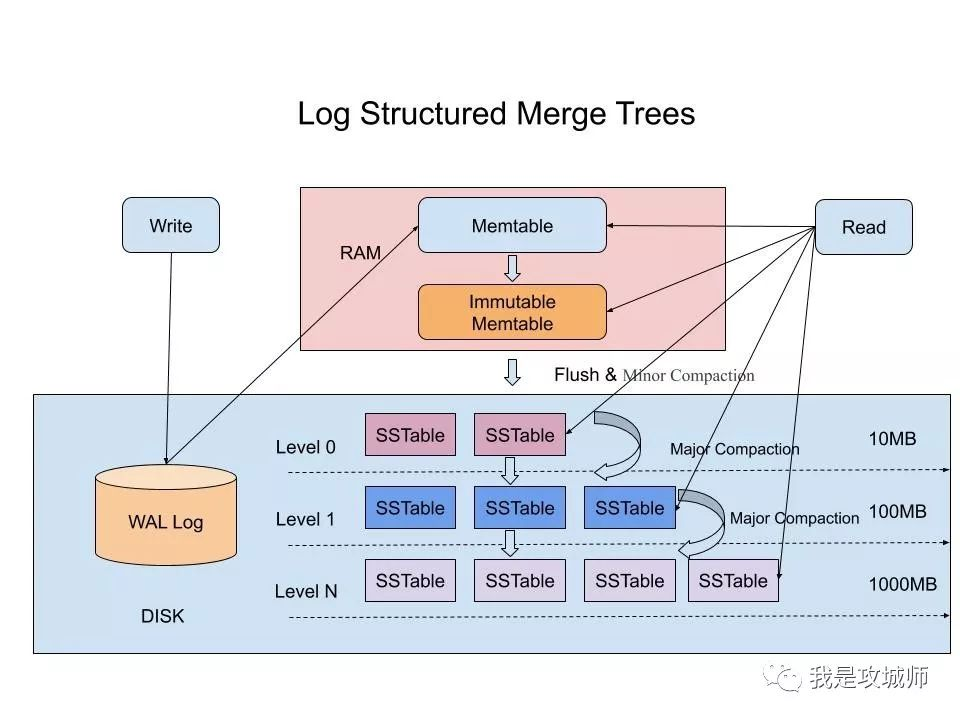

# 架构图

## lst tree

## 特点
```
放弃部分读的性能、换取最大的写入能力
获取最近时间的数据，会比较高效
```
## 写
```
先写redo日志(顺序io)，再写内存
当内存达到一定值时,会压缩合并到磁盘
随着数量+时间推移，数据文件会合并为更大的文件(所以叫leveldb)
```
## 读
```
(1)先读内存，再读磁盘文件
(2)按层级，load每个磁盘文件，根据key会构建一个布隆过滤器，快速判断查找的key是否在文件里
(3)如果布隆过滤器，判断在，则再详细一个一个key比较
(4)重复2和3步骤，直到搜索完所有文件
```
## 删除/更新
```
删除也是更新的一种：将value置为空
更新会新增一条记录，用seqNum分开(类似版本号)
```
## 多版本控制
```
(1)除了memtable可以修改，其他数据文件只能只读
(2)每个数据都有一个版本号，当读的时候会创建一个快照，然后根据版本号来读
(3)后台压缩文件线程，只有压缩完后，才会更新元数据信息，并且压缩后也不会马上删除文件
(4)当文件的引用次数为0时，才真正的删除
```