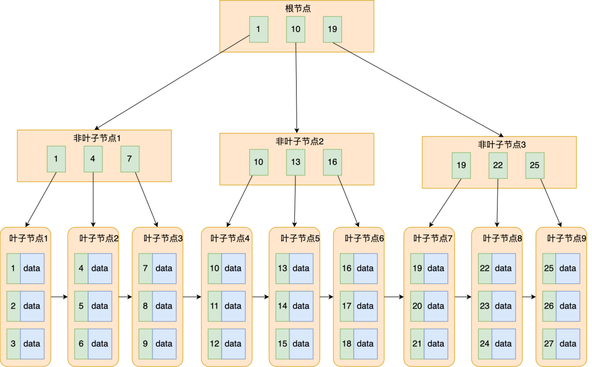

# 基础篇
## 执行一条select sql的流程，是怎么样的？
如select * from test where id>10 and age=20

可以简单记为
```
查询缓存-->解析器(得出语法树)-->预处理器-->优化器-->执行器(调用存储层api)
```
查询缓存
```
几乎没什么用，在mysql8.0就去掉了
mysql8.0之前的版本也可以禁用掉
```
解析器
```
还包括语法分析，举个例子，如form是个错误的关键字，在这一层就能检查出来
```
预处理器
```
检查表是否存在？
将*转换为具体的所有列
```
优化器
```
主要确定sql的执行方案，如有多个索引的时候，确定使用哪一个索引
```
执行器
```sql
执行方案确定下来之后，server层就调存储层的api进行交互(交互的单位是一条记录)
//例如 select id from user where age>20 and reward>=10000 and name like'a%'（age,reward是联合索引），
while(arecord != nil){
    arecord：= call Store(age,reward)//stroe 会定位到age>20且reward=10000的记录
    _r:=call Stroe(id)//回表
    if (_r.name like a) {
        send_to_client(_r)//将结果发送到客户端
    }
}
即server层与存储层交互需要注意的是：
(1)交互单位是一条记录
(2)如果使用的是普通索引存在回表(联合索引可能不用回表)
(3)server 层判断记录是否满足where的其他条件
(4)满足条件的记录，就马上发送到client了
```
索引下推
```sql
如用联合索引查询： select id from user where age>20 and reward>=10000 (age,reward是联合索引)
因为普通索引的叶子节点存储的是主键，所以判断记录是否符合条件在存储就能完成，不必要返回到server判断
```
## 执行一条update 语句的流程
```
(1)也要执行：语法分析器、预准备、优化器，执行器流程
(2)开启事务，定位到记录，开启记录或间隙锁等
(3)两阶段提交
```

## 一条记录是怎么存储的
### 表空间文件的结构
表空间由段，区，页，行组成，关系下如

表空间
```c
逻辑物理空间，由数据段、索引段、回滚段组成
```
段
```
由一个或多个区组成，不要求物理空间连续
```
区
```
在innodb中，由64个页组成(64*16KB=1M)
为了页的连续性(减少随机io)，mysql一次申请4-5个区
```
页
```
innodb中最小的管理单位，一页默认大小为16KB，可以通过参数调整
```

innodb行格式有四种
```c
Redundant //古老的格式，mysql5.0之前
Dynamic、Compressed//根据Compact改造而来
```
注意一行的总长度不能超过65535字节
```c
//65535限制是mysql规定的
所有字段长度+所有变长字段长度+Null值列表所占用的字节数<=65535
//变长字段长度占用说明
如果小于等255如varchar(255)，就占用一个字节
大于255就占用两个字节
```
## Compact格式

举例
```sql
CREATE TABLE `t_user` (
  `id` int(11) NOT NULL,
  `name` VARCHAR(20) DEFAULT NULL,
  `phone` VARCHAR(20) DEFAULT NULL,
  `age` int(11) DEFAULT NULL,
  PRIMARY KEY (`id`) USING BTREE
) ENGINE = InnoDB DEFAULT CHARACTER SET = ascii ROW_FORMAT = COMPACT;
```
### 记录的额外信息
变长字段列表
```
记录varchar(n),txt,blob等变长字段的真实长度
```
null值字段列表
```
表中某些字段允许为null，当真为null时，如果记录到真实数据那，会比较浪费空间，所以这种情况就把它标记到null列表里
// 占用一个字节,即8个bit.
```
记录头信息
```
包含的内容比较多，举例
del_mask//记录是否删除？
netx_record//下一条记录地址
record_type//记录的类型，如叶子节点，非叶子节点等
```
### 记录的真实数据
row_id 
```
如果没有定义主键，则mysql 会有一个隐式id
如果定论了主键，则为主键id
```
trx_id
```
事务id
```
roll_ptr
```
mvcc 上一个版本的指针
```
# 事务
## 事务有哪些特性？
atomicity(原子性)
```
表示这个事务中要执行的语句要么全部成功，要么全部失败，不会存在中间状态。
如果执行过程中有异常(如断电)，那么能回滚到之前的状态
```
consistency(一致性)
```
指事务前后，数据满足完成性约束。举例：
如银行有两个用户A和B，A的余额为800元，B的余额为200元，这时A向B转300元，那么无论转成功与否，这两个用户的余额相加都是1000元。
```
isolation(隔离性)
```
mysql允许并发操作数据，每个事务相当于数据的快照，事务之间的可见性，根据隔离级别来定
```
Durability(持久性)
```
事务成功提交了，那么数据是永久的(除了磁盘损坏等情况)
```
## 事务并发会产生什么问题？
脏读
```
即可以读到未提交的数据
```
不可重复读
```
即同等查询条件，在事务里两次查到的值不一样,如
select age from user where name='a';//假设是17
//...别的事务有提交
select age from user where name='a';//假设是18

```
幻读
```
即同等查询条件，在事务里两次查询到的结果集不一样，如
select count(1) from user where age>18;//假设是10
//...别的事务有提交
select count(1) from user where age>18;//假设是11
```
## sql定义的事务隔离级别
```
读未提交
读已提交
可重复读
序列化
```
## mvcc是怎么根据隔离级别实现事务之间的可见性的？
根据 数据快照(read view) + 记录里的trx_id和roll_ptr 来实现的  
read view
```c
有四个关键的字段:creator_trx_id，m_ids,min_trx_id,max_trx_id
creator_trx_id //创建read view的事务id,猜测是除max_trx_id外的最大id
m_ids //创建read view时，当前数据库中的未提交的事务id(注意是个集合)
min_trx_id //m_ids中最小的事务id
max_trx_id //创建read view 时，数据库中下一个事务id
```
记录里的trx_id和roll_ptr
```
trx_id //记录对应的事务id
roll_ptr //上一个版本的地址
```
### 可重复读级别，如何实现
```
当创建事务的时候，就会创建read view
当事务的语句会根据记录里的trx_id 与 min_trx_id、max_trx_id 、m_ids 里判断
```
判断规则如下
```c
如果最新记录里的trx_id小于min_trx_id,则这个事务可见
如果最新记录里的trx_id大于min_trx_id且小于max_trx_id，则判断trx_id是否在m_ids里
  如果在m_ids里，则事务不可见
  如果不在m_ids里，则事务可见//代表中间的事务生成，如m_ids为[1,3]，此时3版本是可以看见2版本修改的内容
如果最新记录里的trx_id大于max_trx_id，不可见//代表最新记录是由之后事务生成的
```
### 读已提交，如何实现
```
原理和可重复读一样，差别在于创建read view的时机是在执行sql 语句时(即事务里每执行一个sql 都会创建一个read view)
```
### 读未提交
```
事务里每次都读最新数据，不用判断版本号
```
### 序列化
```
事务排队执行(也就不用判断版本号了)
```

# 锁
mysql 有全局锁，表级别锁，行级锁
## 全局锁
```c
//整个数据库只读
flush tables with read lock
```
## 表级锁
表锁
```
表锁也区分读和写锁
读锁：
  多个读锁之间不会阻塞
  但注意持有读锁是不能插入数据的，包括自己
写锁：
  自己能读和写，但其他读和写请求都会阻塞
```
元数据锁(MDL)
```
CURD会申请MDL读锁
修改表结构会申请MDL写锁
目的是保护执行sql的时候，防止表结构变
```
意向锁
```c
//目的
是加表锁时，快速判断表有没有记录加锁了，而不用遍历整张表
//什么是意向锁？
在执行select语句时，mysql会自动加"意向共享锁"
在执行update等更新语句时，mysql会自动加"意向独占锁"
意向锁之间不会冲突
意向锁与行级锁不会冲突
但意向锁与表级别锁(lock table user write)会互斥(除意向共享锁与 lock table user read 这种情况除外)
```
AUTO-INC 锁
```
自增长类型字段的锁，有三种策略
//innodb_autoinc_lock_mode = 0，就采用 AUTO-INC 锁，语句执行结束后才释放锁；
//innodb_autoinc_lock_mode = 2，就采用轻量级锁，申请自增主键后就释放锁，并不需要等语句执行后才释放。
//innodb_autoinc_lock_mode =1
  普通 insert 语句，自增锁在申请之后就马上释放；
  类似 insert … select 这样的批量插入数据的语句，自增锁还是要等语句结束后才被释放；
```
```c
//https://xiaolincoding.com/mysql/lock/mysql_lock.html#auto-inc-%E9%94%81
innodb_autoinc_lock_mode=2性能最高，但是在主从复制的时候且bin log 日志格式是statement时候，有可能发生数据不一致的情况
```
## 行级锁
```
记录锁(一条记录，应对where id=1情况)
间隙锁(锁定一个范围，不包含记录本身)
临键锁(锁定一个范围，并且锁定记录本身)
```
## mysql 是怎么加锁的？
### 唯一索引(包含主键)
等值查询
```
记录锁
```
范围查询
```
临键锁或间隙锁
```
记录不存在的情况
```
临键锁
```
### 普通索引(不包括唯一索引)
```
加锁规则和唯一差不多，不过除了在普通索引加锁外，还要在扫描出来的主键加锁
```
### 没有走索引的情况
```
对所有记录都加锁了，相当于加了表级锁
```
## 如何避免死锁
```c
innodb_lock_wait_timeout//等待锁的超时时间
innodb_deadlock_detect //当检测到有死锁时，回滚某一个事务，让其他事务可以执行
```

# 日志
mysql有三种日志
```c
undo log //事务开启前的日志，用于回滚情况
redo log //事务提交后的日志，用于服务异常恢复事务的情况
binlog//用于主从同步的情况
```
## buffer pool
在介绍各种日志前，先了解下buffer poll。
```c
buffer pool 是各种内存缓存的总称，内里包括了 undo log、redo log 等缓存
//缓存什么时候刷到磁盘?
有参数配置，能做到产即同步到磁盘
```
## undo log 的两大作用
```c
每当执行(新增，修改，删除)时，都会要把回滚的信息记录下来:
//新增
记录主键id，当发生回滚时根据主键id删除
//修改
把修改的列值记下来
//删除
把这条记录内容记下来
//undo log的作用
除了实现事务回滚，还是MVCC(多版本并发)关键因素之一(roll_ptr)
```
## redo log
什么是redo log
```
记录某个物理地址的内容，如：
  记录了xx表空间中的xx数据页偏移量(某个物理地址)做了AA更新。执行一个事务就会产生一条或多条这样的日志
```
WAL技术
```c
写到内存缓存+日志文件(顺序io)
内存缓存，定时刷新到磁盘(随机io)
//作用
(1)随机io变会顺序io
(2)crash safe 能力:服务崩了，可以根据日志文件恢复回来
```
redo log 写满后，会怎么样？

```
redo log 是一个环，红色部分是空闲部分，蓝色是待落盘部分
当check point 追上write pos后，mysql 只允许读，不允许写
```
## bin log
什么是bin log
```c
mysql server层产生的日志，记录表结构变更及数据变更的日志
它主要作用于主从复制和备份恢复
//注意bin log 也有缓存，也不是马上写到文件的(有参数可以控制)
```
bin log的文件格式
```c
有三种格式:
//statement
记录的是sql语句，有个缺点，如果sql语句有now()等函数，那么主从同步，就会产生数据不一致问题
// row
记录的是数据最终被修改的数据，没有动态函数的问题，但记录的数据有可能很多，如执行update 语句，影响了多少行都需要记录，bin log日志可能很大。
// mixed
混合，组合了statement和row格式的优点
```
主从复制的模型
```c
有三种模型：
//同步复制
即同步数据，要等所有从节点应答后，客户端才返回成功
缺点：性能差，可用性差(只要一个从节点有问题，就失败)
//异步复制
不等从节点应答，客户端就返回成功。
缺点：从节点有可能丢失数据
//半同步复制
只要有一个从节点答应了，就返回
```
## 两阶段提交
问题背景
```
执行一条更新语句(事务)的时候，都需要记录bin log 和 redo log日志，这两个都是不原子行为，就有可能产生数据不一致问题。
```
两阶段提交，解决这个数据不一致问题
```c
(1)执行事务前，先在redo log 记录事务为prepare状态
(2)事务commit阶段，先写bin log，然后再标记redo log 为commit状态
//分析，如果在prepare阶段，mysql崩了
那么mysql在恢复的时候，丢掉这个数据
//分析，如果在commit 阶段，写入bin log前崩了
那么mysql在恢复的时候，同样也丢掉这个数据
//分析，如果在commit 阶段，写入bin log后崩了，未标记redo log commit状态
那么mysql在恢复的时候，要写入这个数据(兼容主从数据一致)
//总结
在两阶段提交，只要写bin log 成功，那么数据就要生效，不用看redo log 是commit状态
```
两阶段带来的问题
```c
//磁盘io次数高
bin log 和 redo log 都要写(配置都是同时刷盘情况)
//锁竞争激烈
保证bin log 和 red log顺序一致，举例：
如有三个并发事务，ABC 不可能在bin log记录的顺序是ABC，也要保证在redo log记录的顺序也是ABC
```
如果mysql io很高，有什么优化方法
```
都是基于可数据可丢失的风险基础上：
(1)配置buffer pool 不必马上fsync到磁盘
(2)等N个事务日志后，再刷到磁盘
```
# 索引
什么是索引
```
索引相当于书本的目录，可快速查找到对应的内容
索引还是有序的，可用于有序场景
```
B树
```
有效减少了树的高度，即有效减少了磁盘io次数
```
B+树

```
其实可以理解为是一个有序的双向链表的B树
不仅有效减少了树的高度，而且还充分利用了内存(同样内存大小，存放B+树的索引更多，从而减少了磁盘IO)
```
B树 VS B+树
```
B+树非叶子节点，存放key+页号,而B树即存放key+数据
B+树叶子节点，存放key+数据
B+树查询时，不用中序遍历
```
什么时候需要创建索引
```
比较散列的数据，且要用于查询
GROUP BY 和 ORDER BY 字段(因为索引是有序)
```
什么时候不需要创建索引
```
除了和上面"需要创建索引"的情况相反外，经常修改值的字段也不太适合创建索引(因为可能要调整树)
```
有什么优化索引的方法？
```
前辍索引方法
覆盖索引方法
主键最好是自增的
```
[为什么建议主键是自增的？](https://xiaolincoding.com/mysql/index/index_interview.html#%E4%B8%BB%E9%94%AE%E7%B4%A2%E5%BC%95%E6%9C%80%E5%A5%BD%E6%98%AF%E8%87%AA%E5%A2%9E%E7%9A%84)
```c
因为如果是自增的，在插入的时候，就一直追加
如果不是自增的，在插入的时候，可能会引起页裂
```  
[为什么建议索引都要设置为NOT NULL](https://xiaolincoding.com/mysql/index/index_interview.html#%E7%B4%A2%E5%BC%95%E6%9C%80%E5%A5%BD%E8%AE%BE%E7%BD%AE%E4%B8%BA-not-null)
```
(1)NULL 会使优化器在做索引选择的时候，更复杂//如count会忽略NULL值
(2)NULL是个无意义的值，但却要占用1字节
```
索引失效场景
```c
//没有使用最左前辍原则
where name like'%a'
//使用函数
where len(name)=10
//使用表达式
where id-1=10
//or 条件使用了没有索引字段
where id>10 or age>10//age 没有建索引
//参数与字段类型不符
where phone=15465481230//相当于where phone = strtoint(phone)=15465481230
```
## 联合索引
```
如创建一个联合索引：index(a,b,c)
索引首先会根据a排序，当a值相等时，会根据b排序，当b又相等时，会根据c
联合索引也有最左前辍原则，即如果 select * from T where b=2 and c=3 是无法使用到索引的
```
# 一些知识点
```
ddl语句是非事务的
```
为什么单表不建议超过2000W行数据？
```c
答案：
  Total =x^(z-1) *y，x为一页存储KEY的数量，z为B+树高度，y为一页存储的真实数据数量
详解：
  假设B+的高度为3，即根据ID查询数据有3次IO行为
  每次IO读取一页(一页默认为16K，要减去公共1KB，即能用的只有15K)
  //一个非叶子节点(15K)能存储多少个数据(主键+页号)？
  假设主键为bigint(8 byte),页号(4 byte)
  15*1024/12 约等于1280个主键
  //一个叶子节点(15K)能存储多少个真实数据？
  一行真实的数据受列的类型和个数影响，假设一行要占用1KB，即一页能存储15条数据
  //所以高度为3的B+树(有两层是非叶子节点，一层是叶子节点)能存储的数据为
  1280*1280*15 约等于2.45 KW，即2000W行左右
```
count(*),count(1),count(id),count(other)哪个性能高些？
```c
//结论
count(*)=count(1)>count(id)>count(other)
count()函数是统计不为NULL的记录有多少个
//原因
执行count函数的时候，会扫描所有数据：
(1)没有二级索引时，扫描主键索引，但count(*)不用取出数据，所以比count(id)性能高些
(2)有二级索引时，count(*)会使用二级索引，因为二级索引的节点不存储数据
(3)count(*) mysql内部会转成count(0)，执行过程和count(1)基本一样
(4)count(other)相当于没有索引可走了，全表扫描
//如何优化count(*)?
如果可以取用近似值，则可以用 explain select count(*) from t_table 来优化
如果不可以，那么就要采取额外保存这个计数值
```
delete与truncate的区别
```
delete是一行一行数据删除，事务可以回滚(dml语句)
truncate是drop表后，再创建表，事务不可以回滚(ddl语句)
```
union 与 union all的区别
```
unino 会筛选掉重复记录(排序然后再删除)
union all 不会删除，合并结果就返回
所以union all 性能会比较好些
```
date,datetime,timestamp的区别
```
精度不一样
  date：YYYY-MM-DD
  datetime:只能到秒
  timestamp：可以到毫秒
范围不一样
  date和datetime：1000-01-01到9999-12-31
  timestamp:1970 -- 2037
占用大小不一样
  DATETIME存储8个字节，实际格式，与时区无关
  TIMESTAMP存储4个字节，UTC格式，时区转化
```

