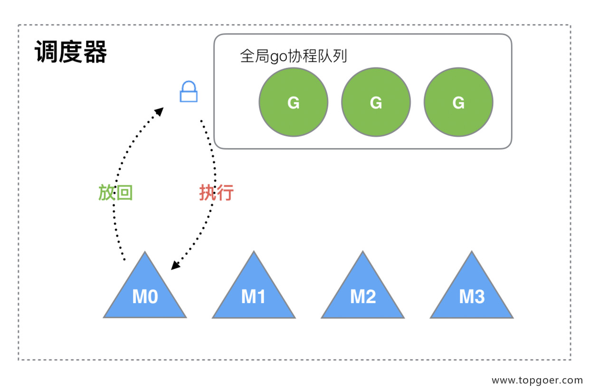

# GMP
什么是GMP，[原理](https://www.topgoer.com/%E5%B9%B6%E5%8F%91%E7%BC%96%E7%A8%8B/GMP%E5%8E%9F%E7%90%86%E4%B8%8E%E8%B0%83%E5%BA%A6.html#%E4%BA%8C%E3%80%81goroutine-%E8%B0%83%E5%BA%A6%E5%99%A8%E7%9A%84-gmp-%E6%A8%A1%E5%9E%8B%E7%9A%84%E8%AE%BE%E8%AE%A1%E6%80%9D%E6%83%B3)
```
G 代表goroutine
M 代表内核线程
P 调度器，会存当前运行的goruntine的上下文(函数指针，堆栈地址及地址边界)及有一个goruntine队列
```
调度
```go
每个M下有一个G0负责从P里获取G来执行
每个G最多运行10MS
如果P队列没有G，则去全局队列里窃取
如果全局队列为空，则从其他P里窃取一半G来执行
如果都取不到，则进入自旋状态
//G阻塞场景
  如果是系统调用阻塞，则M与P会解绑
    当G系统调用完时，M会尝试与P绑定，如果失败
      则G加入全局队列
      M进入休眠或被销毁
  如果网络IO或channel阻塞，则当前G会让出M，M继续取其他G来执行
```
P与M的关系
```
M的数量>=P,M要运行，必须要得到P
M的数量，默认大小为10000，可以用runtime/debug下的SetMaxThreads()来设置
P的数量，runtime.GOMAXPROCS()来设置
```
work stealing 机制
```
  当本线程没有G执行时(全局队列也没取到)，会从其他P里取一半来执行
```
hand off 机制
```
当G发生系统调用而阻塞时，M会与P解绑，然后交给其他空闲的M(从而P队列里的G可以往下执行)
```
go func流程
```
  优先放下本地队列
    如果放不下，则本地队列会移一半G和当前G到全局队列
  G执行
    如果发生系统阻塞
      M会与解绑，P会与其他M绑定
      当G系统调用完后，M会尝试绑定P，如果绑定失败
        则G加入全局队列
        M进入休眠或被销毁
```
## 可视化 GMP 编程
```
  作为课外知识了解
    可以用go tool trace 来分析，GMP相关令牌
```
补充
```
本地goruntine队列最多只有256个
```
## GM模型的缺点

```
（1）有一个全局锁
（2）G里创建G'，为了执行继续执行G，要把G'转移到M'上，但其实这是跟G相关的，最好放到M上执行(CPU缓存之类的)
（3）系统调用 (CPU 在 M 之间的切换) 导致频繁的线程阻塞和取消阻塞操作增加了系统开销。//这个没理解
```