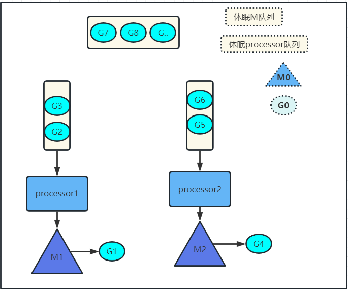

# GMP
```
G 代表go routine
M 代表系统线程
P 代表processor(调度器)
```
G与M的关系是M:N，即多个G可以对应多个M  
## 概念图  


### 场景1，创建一个G的流程
如G1 创建一个G  
```go
go func(){...}
//那么这个G会优先放到processor1  
//如果processor1放不下了，会放到全局队列
```
### 场景2，G发生阻塞
如G1调用io.read()发生阻塞  
(1)那么processor1会与M1解绑，从休眠M队列或创建一个新M，重新绑定  
(2)如果G1醒来，发现找不到process1，此时G1会加入全局队列
(3)M1会加入休眠队列或销毁
### 场景3，自旋线程
自旋线程：即M没有执行的G且队列也为空  
(1)那么会尝试去全局队列拿一批G来执行
(2)如果从全局队列拿取失败，则从其他队列里拿
### 注意
```
(1)M0的作用是：负责程序启动时，初始化上下文等，当初始完后，会变成一个普通的M  
(2)G0的作用：每个process都有一个G0用来调度G到M执行  
(3)每个G执行最多执行10ms，超时后，重新加入队列，重新抢M执行
(4)每个G启动的栈很小(2kb或4kb)，如果不够用时，可以扩展，最大达1G
```
