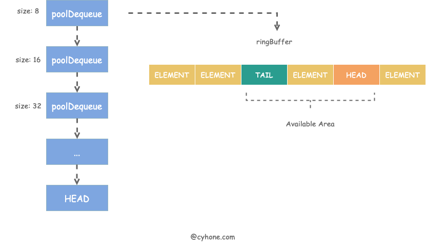
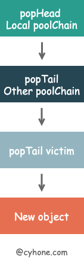

# sync.pool
```
(1)利用 GMP 的特性，为每个 P 创建了一个本地对象池 poolLocal，尽量减少并发冲突
(2)localPool有一个链表(poolChain)，链表元素是一个ringBuffer
(3)put对象时，如果ringBuffer满了，则会创建一个新的
(4)get流程，先获取本地的-->窃取其他P的-->上一轮的缓存池获取-->调用户New方法
```
## poolChain示意图

## get流程


# sync.WaitGroup
```
利用信号量，原理：
(1) wg.Wait()的时候获取指定的信号量数
  当满足了信号量时，则程序可以继续运行
  否则程序挂起
  程序挂起，调内核保障，不用太关心细节
(2) wg.Done()的时候放一个信号量

```
# sync.Mutex
```
加锁的原理是cas设置一个变量值为1，设置成功则获取到锁
获取不到锁的协程，则进入等待队列
锁有两种模式：正常模式和饥饿模式
```
正常模式
```
当释放锁的时候，会从等待队列唤醒一个G，但这个G可能跟后面来的G抢锁
而后来的G，可能处于自旋状态，更有机率获取到锁
```
饥饿模式
```
当从等待队列唤醒G，排队时间超过1MS且没获得到锁，就会将锁标记为“饥饿模式”
那么后面来的G就不自旋和参与抢锁，而是直接插入到队列尾部
```
饥饿模式-->正常模式
```
当从等待队列唤醒的G等待时间没超过1MS时，就将锁切回正常模式
当等待队列为空后，也会将锁切回正常模式
```
# map
特点（[原理](https://qcrao91.gitbook.io/go/map/map-de-di-ceng-shi-xian-yuan-li-shi-shi-mo)）
```c
(1)hash(key)后，用低N位bit确定桶的位置
(2)桶有个tophash数组([8]byte)用来存储高8位的hash值(这样的好处是提高检索key的效率)
(3)每个桶固定能存储8个kv
(4)桶内是按照/k/k/.../v/v/..来存储的，并不是按k/v这样存储//golang解析说，这样能有效节省空间(内存对齐)
(5)扩容方式是渐近式的(类似redis的dict)
//如何计算map有多少个桶？
如果N是5，那么有2^5=32个桶
//tophash 为什么能提高检索key的效率
(1)经过hash(key)定位到具体桶后，key的前辍大概率是不一样的
(2)整形比较给其他类型快
```
get过程
```
(1)根据hash(key)得到64位的二进制
(2)低N位用来定位到桶
(3)用高8位的值来检索topHash
(3.1)如果找到了，会进一步检查key是否相同(如果key不相同呢？网上没答案)
(3.2)如果topHash检索完没有目标值，且溢出桶不为空，再继续用上述过程检索溢出桶
```
delete过程
```
根据key定位到位置，然后将key和value“清零”
```
赋值过程
```

```
扩容
```c
//扩容条件
(1)负载因子超过6.5，count/2^B>=6.5，翻倍扩容
(2)溢出桶过多(新增元素后，又大量删除)，等量扩容。
(2.1)如果B小于15，溢出桶大于2^B,则也会触发扩容
(2.2)如果B大于等于15时，溢出桶超过2^15也会触发扩容
//扩容过程
(1)标记map正在扩容
(2)采用渐进式迁移,一次最多迁移两个桶(注意迁移桶时，也会迁移溢出桶)
(3)如果是翻倍扩容(即相对于原来多了一位bit)，有个小技巧，多一位bit如果是0，则新的桶编号和原来的编号一样，如果是1，是翻一位后对应
```
## map 一些注意事项
同一个协程，可以边遍历边删除吗？
```go
for k,v:=range m{
  delete(m,k)
}
答：是可以的
原理：删除只是将key和value“清零”，底层数组未变化
```
为什么每次遍历map都是无序的？(即使这个map只是只读)
```c
因为每次遍历都会从一个随机桶+随机cel开始。
//为什么要随机？
因为 map存在扩容的情况，且会有中间状态
在中间状态下，每次遍历都会不一样
所以为了兼容这种表现，go每次遍历都会随机开始
```
float64可以做为map的key吗
```c
答：可以的
原因：如果key是float64，map会将float64转为unint64（math.Float64bits()）
      两个float64，如math.Float64bits(2.4)和math.Float64bits(2.4000000000000000000000001)会相等
      所以慎用float64作为key
//math.NaN情况
m[math.NaN]=1,m[math.NaN]=2，map会存两个
原因是map判断是NaN时，会加一个随机值，hash(randNum)
//key是必须是可以比较的
如slice,map 是不可以做为key的
```
# sync.Map
```c
一般情况实现并发安全的map+mutex，但这样读和写都要加锁，效率有点低。
sync.Map 内部维护read和dirty两个map，实现了读写分离
//读操作,对应Load方法
(1)优先从read取 no lock
(2)如果从read没取到，再从dirty里取 have lock
//写操作，对应strore方法，有三种情况
(1)如果read里有，则CAS更新，no lock
(2)如果dirty里有，则更新，have lock
(3)如果read和dirty都没有：have lock
    将read的值拷贝到dirty
    将新值存入到dirty，并标记read和dirty不相等
//删除操作
(1)如果read里有，标记为删除
(2)如果dirty里有，直接删除

//注意
Load方法会统计从dirty取的次数，当超过一定次数时，会将dirty赋值给read
```
优缺点
```
适合读多写少场景
```
# context
```
对外有六种context：
  cancel,deadline,timeout,value,todo,backgroud
内部有四种
  emptyCtx,valueCtx,cancelCtx,timerCtx
其中 timeCtx继承了cancelCtx
timout,deadline 对应了 timerCtx
todo,backgroud对应了emptyCtx
```
timeout和deadline context原理
```
使用了 time.After()关闭done chanl
```
父context cancel，子context也跟着取消
```
首先new子context时传入了父的ctx,如context.Withxx(parentCtx)，然后会启动一个协和监听父是否cancel了，如果父cancel了，自己也会cancel掉
```
多个context间同样的key，value不会覆盖，但获取时优先取到最近的
```
根据key获取value时，类似链表从送开始往后查找，当查到了就返回了
```
# channel
## 原理

## channel三种状态和三种操作结果
| 操作     | 空值(nil) | 已关闭   | 未关闭 |
| -------- | --------- | -------- | ------ |
| 关闭     | panic     | panic    | 正常   |
| 发送数据 | 永久阻塞  | panic    | 正常   |
| 读取数据 | 永久阻塞  | 永不阻塞 | 正常   |

# interface
```
interface变量内部包含了两个字段：类型T与值V
当两个interface比较时，先比较T再比较V
当“其他变量”与interface比较时，先将“其他变量”转换为interface再比较
```
当一个类型指针赋给interace后，判断是否为nil
```go
  var p *int
	var i interface{}
	i = p
	t.Log(i==nil)//false
//为什么是false?
因为首先要将nil转换为interface即(T=nil,V=nil)，而i的结构为(T=*int,V=nil)，所以不相等
```
# go语言初始化顺序
```
import-->const-->var-->init-->main

同包init顺序，不保证
```
# golang 有两种字符类型
```
英文字符类型用1个byte（即一个字节就可以表示 ASCII）
其他字符(1~4字节)，如中文(3字节)要用rune
```
# defer
```
在函数返回前运行，触发时机有三个：
（1）遇到return
（2）函数末尾
（3）遇到panic
defer对应有一个_defer结构体，实现defer有三个版本：
go13之前，_defer结构体会在堆上分配，执行时需要将堆上的变量拷贝到栈上，性能比较差
go13 _defer结构体，实现了在栈上分配，性能相比之前提升了30%
go14实现了开放式编码(直接将derfer 函数在当前函数展开)，性能损失几乎可以不计，但也有条件：
  (1)未关必内关联
  (2)没在for循环里调用defer
  (3)函数乘积没超过15
```
# panic
对应了runtime._panic结构体
```go
type _panic struct {
	argp      unsafe.Pointer //指向defer 指针
	arg       interface{}// 调用panic时的参数
	link      *_panic//上一个panic
	recovered bool
	aborted   bool
	pc        uintptr
	sp        unsafe.Pointer
	goexit    bool
}
```
嵌套panic
```go
func main() {
	defer fmt.Println("in main")
	defer func() {
		defer func() {
			panic("panic again and again")
		}()
		panic("panic again")
	}()
	panic("panic once")
}
输出结果：
panic once
panic again
panic again and again
in main
```

## defer,panic,recover
panic 只会触发当前goroutine
```go 
func f() {
  defer print("f defer")
  panic("aa")
}

func main(){
  defer print("main defer")
  go f()
  time.sleep(1)
}
//结果不会输出 main defer
```
recover只在panic之后生效
```go
func main(){
  if err:=recover();err != nil {
    print(err)
  }
  panic("aa")
}
//结果recover捕获不到err
正确的例子：
func main() {
  defer func(){
    if err:=recover();err!= nil {
      print(err)
    }
  }
  panic("aa")
}
```
# ==,比较
一个比较相通的原则是，[比较详细的介绍](https://darjun.github.io/2019/08/20/golang-equal/)
```
只有类型相同且值相同时，==比较才是true
```
golang可以分为四大类型：
```
基本类型：int,float,string
复合类型：array和 struct
引用类型：pointer，slice,map,channel
接口类型：如error
```
注意
```
两个slice之间不能比较，只能和nil比较
两个map之间不能比较，只能和nil比较
```
两个interface比较
```
(1)类型要相等
(2)值要相等(用的是==比较法)
(3)如果interface指向的是slice或map会报panic，因为两个slice或两个map之间是不可以比较的
```

