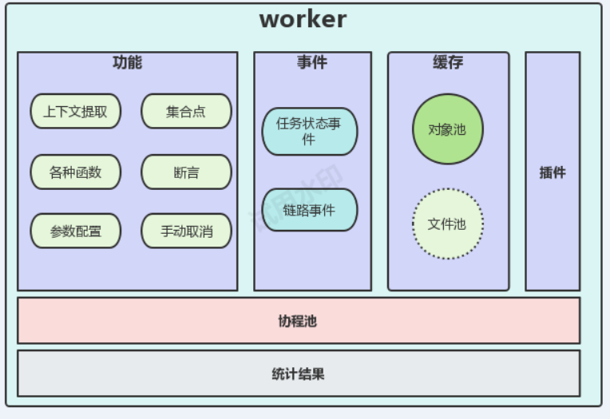

# worker架构图

# 业务描述
```
http、websocket 全链路压缩测
调式、上下文提取、断言、aksk接口鉴权、
```
## 一个接口的请求分析
```
(1)支持常见请求方式：get、put、post、delete
(2)url 参数值要求动态
(3)header 值要求动态 
(4)请求体类型要支持json,text、表单、上传文件等，且要求body也要动态
(5)代理功能
```
## 多个接口分析
```
存在依赖关系，下一个接口的参数是从上一个接口获取
要支持断言，上个接口出错了，不继续压测
有些是预热接口，不参与压测
有些是清理接口，压测完回调
```
# 功能实现
## 断言
```c
//断言方式
根据状态码断言
根据返回的内容做断言
//期望值的来源
用户固定、从返回的内容里提取
//比较条件
等于、小于、大于、包含等
//场景
要支持调式和压测场景
```
### 实现
把response传进去，大概分为三大部分：
```
(1)压测执行器(失败了不需显示错误值)、调式执行器(失败了要显示错误值)
(2)状态码断言、提取参数断言
(3)数字比较器、字符器比较器
```
## 动态参数
```
函数、自动生成文件、rsa、压缩、sha1、base64
```
### 支持用户设置参数
```
顺序循环读
随机读
```
### 支持各种函数
```
uuid、时间戳、base64、sha1、md5、随机数字、随机字符串
```
### 支持对称加密、非对称加密
```
rsa_value、aes_value
```
### 自动生成文件
```
支持生成txt、xlsx
支持生成指定大小
随机内容
文件池
```
### 链路value
```
背景：有些函数每次调用返回值不一样，但同一个链路下可能多处使用，要求值都一样。
实现：
    chain_xx_value订阅事件，
    链路执行完，广播事件
```

## 支持deflate、gzip压缩请求：
```
(1)用户在请求头设置压缩方法
(2)将压缩实现为io.reader接口
(3)压缩reader替换request的body
```

## 集合点
```
事件原型，信号量，大概流程：
    发送请求前，apply()申请信号量
    执行完后，进入等待（sync.Cond）
实现细节：
    worker与cpserver 建立长连接
    连接有cmd有：申请信号量，上报本次完成，唤醒
```

## 结果统计合并
```
正常的：按秒合并统计
错误的：最多收集5000个(可配置)
统计的维度：除 线程数 外，其他维度都按 状态码 区分开：maxRT,minRT，sumRT,，请求大小，返回大小,请求次数
```
## 事件广播
任务广播
```
事件类型有：Waiting、Doing、Done、Remove
    Waiting：增加发压记录
    Doing：开始结果统计线程
    Done：标记着不再有发送请求，释放一些资源，如完全清除发压文件等
    Remove：标记着统计结果完成，可以全部清除发压相关
Remove事件的触发：
    master取完全部结果
    取完全部结果的条件是：发出去的次数=收回的次数，且master来拿了结果
```
## 线程池
```
(1)是复用gorutine
(2)按秒维度记录当前活跃线程数
```
## 插件
```go
用第三方库实现：大概原理就是启动一个grpc 进程，然后用grpc通信
业务需实现接口：
    Encoded(jsonMessage) Message
    Decode(Message) jsonMesage
        目前与hulk通信只支持json
        Message是业务的结果
type Message struct{
    Type int //对应websocket数据类型，如TextMessage = 1,BinaryMessage = 2
    Data []byte
}
```