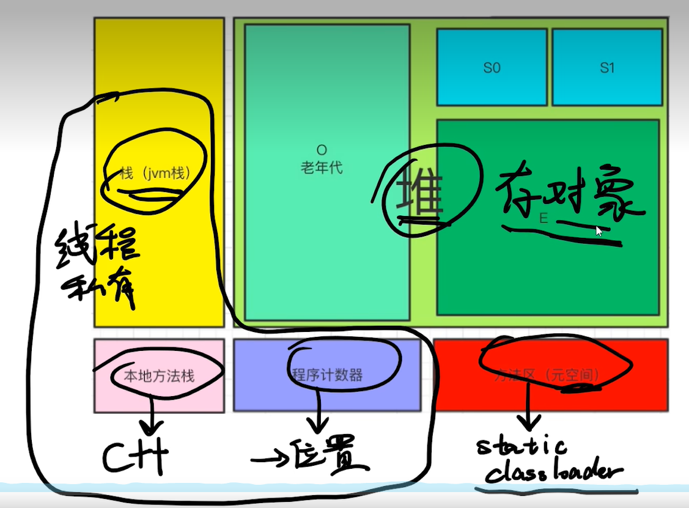

# jvm
虚拟机内存内存模型,大概分为五个区域
线程私有
```
jvm 栈
本地方法栈
程序计数器
```

线程共享
```
方法区
堆
```


## 堆
分为两大块：年轻代和老年代
### 年轻代
常用于存放new object 对象(大对象除外)  
特点：这里面对象，大多都是存活不久的  
常使用：复制算法
### 老年代
存放：多次gc回收后还存活的对象+大对象  
常使用：标记清理或标记整理算法

## gc常见算法
### GCRoot
判断一个对象是否可以被清理，就看这个对象是否能被GCRoot引用到  
GCRoot来源有三个：jvm栈、本地方法栈、方法区
### 标记清理
```
将要删除的对象标记下，然后清理掉
缺点:容易产生内存碎片
```
### 标记整理
```
将要用的对象向前移，解决了内存碎片问题
缺点：涉及内存移动，代价有点大
```
### 复制
```
将总内存一分为二，将要用的对象复制到二里
缺点：内存利用率不高
```
## 常见的垃级回收器
parnew（用于年轻代）
cms(用于老年代)
## 最新垃级回收器
G1