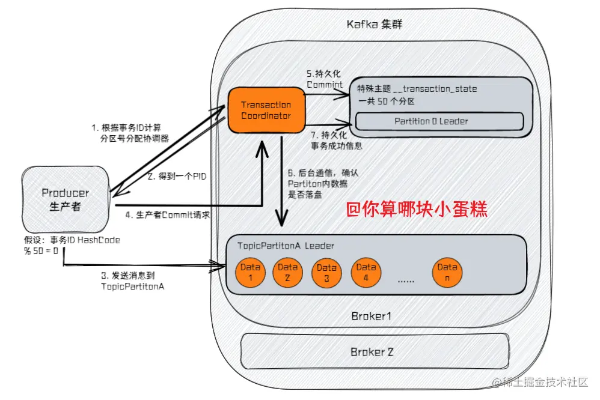

# 一些关键词
producer
```
注意生产者本地也有缓存，当消息达到一定条件后，再发送。
目的是减少网络io，提高吞吐量。
当然也可以在发送消息的时候，设置一个回调方法，当真正发送完消息时触发。
```
consumer
```
(1)消费者的数量不要超过partition数，否则将有些消费者没用
(2)消费者一般手动提交确认消息，如果自动提交会有丢消息的风险：业务取了消息，并未处理完消息，这时业务挂了，但又提交了offset，这样业务下次就消费不到了
```
topic,partition,replica
```
为了提高topic的吞吐率，可以为topic设立多个partition
为了保证partition的高可用，可以为一个partition设立多个replica
replica里可以分为:leader+follower
leader：负责读和写
follower：只是同步leader数据而已
```
HW和LEO
```c
每个副本都有HW和LEO，消息队列和HW、LEO的关系
[--(已提交)--HW--(未提交)--LEO]
HW前的代表已同步到follower，consumer可见
HW后的代表未同步到follower，consumer不可见
LEO代表新消息插入点

leader HW=MAX(localHW,MIN(followers LEO))
follower HW=min(leaderHW,LEO)
```
ISR
```
同步leader且未落后太多的follower集合
可以参与leader竞选
```
OSR
```
同步leader但落后比较多的follower集合
一般不可以参与leader竞选，但可以通过配置支持
```
## 消息的语义
最多一次
```
即producer发送消息后，就不管kafka有没有收到了
可能存在丢失消息的可能，如网络异常
```
最少一次
```
即producer一直发送，直到收到kafka的回复
可能存在重复消息的可能：如kafka在ack时，网络异常，导致producer第二次提交
```
精准一次
```c
一个消息只会被成功接收一次(幂等性)
//原理
producer 和 broker 共同维护一个producerID+seqNum
if msgSeqNum==brockerSeqNum+1 {
    消息合法
}
if msgSeqNum>brokerSeqNum+1 {
    消息乱序了，上一次可能有消息没有持久化，丢弃
}
if msgSeqNum<brokerSeqNum+1 {
    说明消息重复提交了，丢弃
}

//注意
producer id 每次初始化都不同
幂等性只支持到partition
```
## 事务原理

```c
支持多个topic的消息，一次性提交多条消息，要么全部成功，要么全部失败。
使用的是分布式事务两阶段提交，大概流程：
(1)根据事务id得到，事务协调器
(2)向事务协调器，发送topic,partition等消息
(3)向broker发送消息
(4)向协调器发送commit或abort//注意producer不会等协调器处理结果，而是马上返回
(5)协调器后台处理commit或abort消息

//协调器
默认有50个分区，根据hash(事务id)%50得到具体协调器
```
[详细流程](https://juejin.cn/post/7122295644919693343)

# kafka会不会丢消息？
会，丢消息的可能性分析
```c
//消息语义层面分析
在最多一次的情况下，肯定会丢失
在最少一次和精准一次，需要看brocker端

//producer层分析
使用缓存肯定会丢失

//consumer层分析
如果使用自动提交，肯定会丢失(offset情况)

//broker层分析
如果leader不等follower同步，肯定会丢失
如果没启动刷盘，肯定会丢失
```
## 消息不等follower同步
即kafka默认值，producer发送消息只要leader处理了，就回复成功
```c
//场景1,数据丢失
(1)follower宕机了，重启回来后用HW截断日志
(2)在向leader请求同步数据时，leader刚好宕机
(3)此时follower成为leader，那么就会丢数据了
//场景2，数据不一致
(1)leader和follower同时宕机
(2)follower先重启回来，截断消息，此时follower就成为leader，并处理了producer发来的消息
(3)旧leader重启回来，成为follower，在同步数据时，发现HW一样，就不做任何调整
```