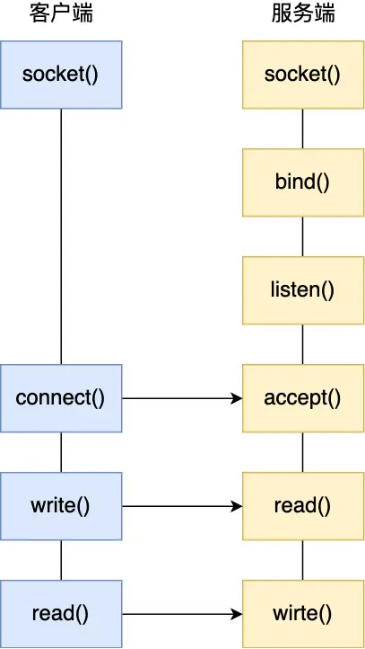

# io多路复用的演变
## 客户端与服务端建立连接

```c
//bind的作用
绑定ip和端口
//listen的作用
开始监听网络事件
//accept的作用
服务端阻塞，直到有客户端连接上来时才返回
```
## 如何服务更多的客户
```
(1)多进程
(2)多线程
(3)多路复用(select/poll/epoll)
```
### 多进程
```
即在accept返回时，fork一个子进程来服务一个socket
```
### 多线程
```
即在accept返回时，new一个线程服务一个socket
```
### 多路复用
```
既然原来一个socket就要分配一个内核层的(线程/进程)不合适，
那么能不能用一个内核线程服务所有socket呢，这就是io多路复用。
```
select/poll
```
大概原理：
    (1)将fds拷贝到内核，让内核监听事件
    (2)如果有事件则标记fds，然后返回
    (3)用户态再次遍历fds寻找有事件的fd
缺点：
    需要在用户态和内核态拷贝fds
    当有事件时，用户态需要再次遍历寻找fd
    select默认有1024限制
```
epoll
```c
//大概流程
(1)把需要监听的fd加入到红黑树中
(2)当有事件时，将fd加入到就绪链表

var events list//事件就绪列表
(1)epfd:=epoll_create()
(2)epoll_ctl(efpd,listenfd)
(3)n:=epoll_wait(events)
for i:=0;i<n;i++ {
    read(events[i])
    ...
}
```