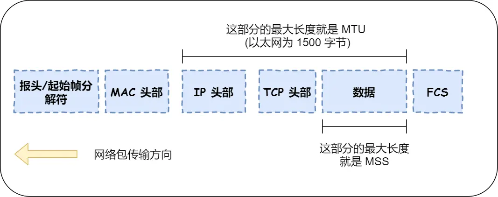
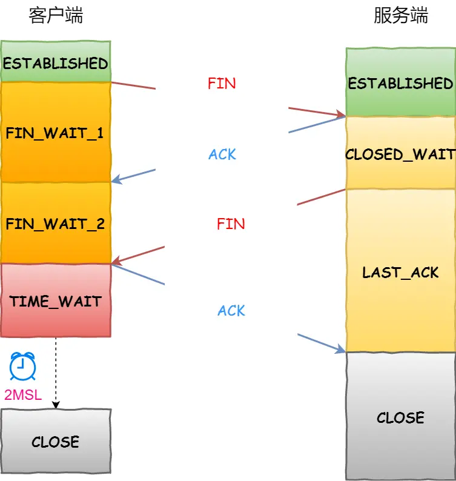
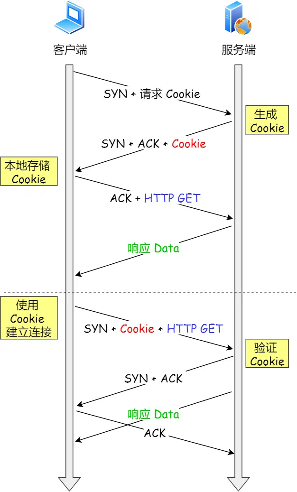

# tcp
连接四元组
```c
源ip+源端口+目标ip+目标port
即这四个元素只要不相同，就可以组成一个连接
服务端端口一般是固定，所以当客户端向服务端发起连接时，会随机一个端口，即client ip+随机端口+server ip+ server port
```
## 三次握手
```c
(1)client syn+client_isn(序列号)//client 处于syn_sent状态
(2)server ack client_ins+1, server_isn//server处于 syn_rcvd状态
(3)client ack server_isn+1(此次client可以携带数据包)// client 处于established状态
//如果服务端也收到了client 的ack，那么也会处于established状态
```
为什么不是两次握手？
```
两次握手没办法避免，历史连接：
假设client发送 syn 后，就突然崩了，重启后又发一个syn 给服务端，那么如果是两次握手就建立连接，服务端就会造成资源浪费。
```
为什么不是四次握手？
```
没必要，三次就可以了（其实是第二步的时候，合并了两个步骤）
```
三次握手有什么成效？
```
(1)阻止了历史连接(两次握手情况)
(2)确认了双方的序列号
(3)避免资源浪费(两次握手情况)
```
MTU与MSS
```c
MTU:一个网络包的最大长度,以太网一般为1500子节
MSS:除去ip和tcp头部后，一个网络包所能容纳的TCP数据最大长度
//MTU-20字节TCP报头-20字节IP报头，那么在以太网环境下，MSS值一般就是1500-20-20=1460字节
```

既然ip层可以对数据包进行切片传输，为什么tcp还需要MSS呢?
```
因为ip层不是可靠性传送，发生丢包不会重传。
假设没有MSS，一个非常大的tcp包，需要在ip分片传输，当其中一个切片包丢失了，那么就需要整个数据包重传了。
```
tcp第一次握手失败会怎么样？
```
会触发client端重试发送syn包
重试次数，由tcp_syn_retries参数决定
```
tcp第二次握手失败会怎么样？
```
会触发客户端和服务端重传数据包：
client 处于syn_sent状态，但收不到服务端的ack包，然后又触发重传syn包
服务端处于syn_rcvd状态，但收不到客户端的ack包，然后就触发syn_ack重传，重传次数由tcp_synack_retries决定
```
tcp第三次握手失败会怎么样？
```
client 处于established状态
服务端由于收不到客户端的ack，那么触发重传syn_ack
```
重传规律
```
观察握手各阶段的失败，重传只发生在“syn包”，“ack包”是不会重传的
因为第二次握手失败，客户端和服务端都有发送syn包，所以都触发了重传
```
syn包攻击
```
服务端tcp有两个队列：半连接(syn队列)和全连接(accept队列)
攻击者伪造大量syn包，导致服务端的syn队列满了，服务不能正常服务，这称为syn包攻击
```
避免syn攻击策略
```
(1)调大syn队列
(2)开启 syncookies 功能（正常的流程是syn队列-->accept队列）:
(2.1)即syn队列满了，不再进入syn队列，而是根据算法计算出一个cookie，然后返回给客户端
(2.2)客户端第三次握手时，服务端检查这个cookie的合法性，如果合法，则直接建立连接(即进入accept队列)
```
## 四次挥手

```c
(1)client发送fin包//客户端处于fin_wait_1状态
(2)服务端 ack fin包//服务端处于close_wait，客户端如果收到后fin_wait_2状态
(3)服务端发送fin包//服务端处于last_ack状态
(4)客户端 ack fin//客户端处理time_wait状态

//注意2步骤转到3步骤 必须由应用进程调close，内核没有权利代替应用进程调close
```
为什么需要四次挥手？
```c
(1)步骤是客户端告诉服务端，我没有数据发送了
(2)步骤是服务端回复客户端，我收到你的断开连接请求了//此时服务端可能还有数据要发送给客户端
(3)步骤是服务端告诉客户端，我没有数据发送了
(4)步骤是帮助被关闭一方(服务端)优雅关闭连接

//特定情况下，挥手可以是三次(tcp延迟发送)
```
time_wait
```
time_wait状态只有主动关闭连接端才有
time_wait的时长为2msl(60秒)，当主动方收到被动方的fin包，并回复ack fin开始计时
```
time_wait 为什么是2msl？
```c
//背景知识
(1)ip包有一个ttl字段，一般值为64，第当跳过一个路由时，就减1，当值为0时，就会丢弃这个数据包(然后用icmp告诉源主机)
(2)msl(max segment lifetime)最大生存时间，这个值linux一般为30秒，即linux认为一个数据包经过64个路由的时间不会超过30秒，超过则丢弃。
//为什么是2msl？
(1)假设server端第一次发送fin包到client的耗时，趋向于0
(2)client 回复server端，ack包网络超时了(1msl)
(3)server端重传fin包(1msl)
所以time_wait需2msl
```
time_wait的作用
```c
(1)帮助被动方，优雅关闭连接(server端重传fin包情况)
(2)保证数据包在网络上都消失掉//防止旧连接数据，被新连接接收，造成数据错乱
```
tcp 保活机制
```c
//背景
如果客户端与服务端建立起了连接，这时客户端突然宕机了，那么服务端显示这个连接依然是establish状态的。
//tcp 保活机制
系统可以开启tcp连接保活机制，但默认值一般比较大(2个多小时)才能发现连接无效，一般应用层都有自己的keepalive，而且比这个值比较小，如60秒
//注意，一定是主机宕机情况，如果是应用程序崩了，内核在回收应用进程时，是可以fin报文中断tcp连接的。
```
## 重传机制
超时重传
```c
//超时值(RTO)怎么定？
因为每个网络都不同，所以RTO是不能是固定的
RTO值一般比RTT略大一点，是根据算法算出来的
//什么是重传？
超过一定时间(RTO)未收到ack包，就重传那个数据包
```
快速重传
```
当发送方收到三个相同的ack，就快速重传那个数据包，而不必等到那个数据包超时后才重传
```
SACK（Selective Acknowledgment）
```c
选择性确认，在回复三个相同ack的时候，还可以在ack 头部添加SACK字段，告诉发送方我接收到了哪些数据。
最终目的告诉发送方哪些数据没收到需要重传。
//三个相同ACK样例（需要重传数据包1）
ACK=1,SACK=2
ACK=1,SACK=3
ACK=1,SACK=4
```
Duplicate SACK
```
告诉发送方，收到了重复的数据包。
发生的场景：当数据包1被网络延迟了，接收方回了三个ack 1，触发数据包1重传，当重传的数据包1被接收到后，被延迟的数据也到达了，那么接收方可以告诉发送方，数据包1重传了。（ACK 5,SACK=1）
```
滑动窗口
```c
//背景知识
如果要发送一个数据包，并且要收到它的回复，才能发送下一个数据包，那么效率太低了。
//滑动窗口
即数据缓冲区，只要数据包没超过缓冲区，那么发送方可以在没有收到对应ack的情况下，继续发送数据包。窗口大小通常由接收方决定。
```
流量控制
```c
//流量控制
发送方根据接收方的实际接收能力来控制发送数据量
//接收方实际接收能力
滑动窗口大小，即使在通信过程中，也不是固定不变的。例如客户端上传文件的例子，建立连接时的窗口大小为600，在上传文件过程中，突然服务端资源紧张，原来的窗口大小被系统调整为200，那么客户端不能一无脑的按原来600大小发送数据了，应该也要按200大小来控制发送数据
//窗口关闭
即窗口大小为0，当窗口大小为0时，发送方会定期发探测包，探测接收方的窗口大小。
//糊涂窗口
ip头+tcp头的大小约为40个字节，当数据包很小时(如几个字节)，如果也一直发这样的数据包，那么就很不划算了，简为“糊涂窗口”。
开启Nagle算法，可以避免发送这种小数据包。它的思想是延迟累积后再发送。
```
拥塞控制
```c
//拥塞控制vs流量控制
流量控制：是根据接收方来控制窗口大小
拥塞控制：是根据网络状况来控制窗口大小
实际窗口大小=min(流量控制,拥塞控制)
//拥塞控制相关算法
慢启动：即刚开始时发送1个数据包，如果成功收到ack，下一次就发2个数据包，再下一次发4个数据...(不能超过ssthresh=65535子节)
拥塞避免算法：当慢启动超过ssthresh大小后，增长速度不再翻倍了，而是调小增长速度
//拥塞发生
当发生超时重传或快速重传时，说明网络发生拥塞了。
如果是超时重传，说明网络状态比较差，会把发送窗口调到比较小
如果是快速重传，说明网络相对没那么差，适当调整小窗口
注意：当因拥塞而调小窗口后，会再尝试慢启动试探增大窗口大小
```
如果序列号发生回绕，怎么检测是上一轮的数据包？
```
(1)开启 tcp_timestamps选项，这样发送数据包时，都会带上时间戳
(2)发送方和接收方都维护一个最后数据包的时间，当收到数据包的时候，对比最后一次时间，如果时间不是递增的，代表是历史包，则丢弃
```
处于established状态，收到一个syn包，会发生什么？
```c
//问题重现
(1)假设客户端与服务端创建连接后，突然客户端宕机，重启后又与服务端建立连接(假设四元组都一样).
(2)这时服务端还维护了上一次的连接并且状态是established，那么服务端会回复正确的序列号和确认号给客户端
(3)但客户端收到的确认号并不是自己期望的，所以会发送一个rst包
(4)当服务端收到rst会断开连接

//扩展知识，如何关闭一个tcp连接？
(1)模拟一个连接(即这个连接的四元组与真实的连接一样)
(2)发送一个syn包，获取正确的序列号
(3)根据序列号，伪造一个rst包，这样就达到关闭一个连接了。
```
如果收到一个乱序的fin包，会马上进入time_wait状态吗
```c
//问题重现 
即服务端处理close_wait状态，发了业务数据包+fin包，但业务包由于延迟，fin包先抵达。
//客户端处理
客户端会将fin包放入到乱序队列，待业务数据包到达后，再从中取出fin包，然后再进入time_wait状态
```
如果处于time_wait状态，收到syn包，会怎么样？
```c
//问题重现
服务端发起关闭连接，并且处于time_wait时，客户端快速发起连接(发起syn包)
//服务端处理
判断syn包是否合法？
如果合法：则由time_wait转到syn_recv状态
如果不合法：服务端回复正确的序列号和确认号给客户端，客户端判断不是自己期望的确认号，则发送一个rst包给服务端。

//怎么判断一个序列号是否合法？
//未开启时间戳的情况
if (序列号>期望序列号) {
    合法
}else {
    不合法
}
//开启时间戳情况
if (序列号>期望序列号) && (时间戳>最后一次时间戳){
    合法
}else {
    不合法
}
```
## 如何优化tcp
### 三次握手
```
(1)根据实际情况可以减少syn包重传次数，快速告诉应用程序失败了
(2)调整半队列，全队列的大小，半队列还可以开启cookie功能
(3)客户端和服务端同时开启tcp fast open
```
tcp fast open原理
```c
(1)第一次建立连接还是三次握手，但会生成一个cookie
(2)第二次建立连接时，携带syn+cookie+请求这三个数据，如果服务端判断cookie有效，则就建立好连接了//相比正常握手流程，少了最后一次握手
```


### 四次挥手
### 数据传输过程中