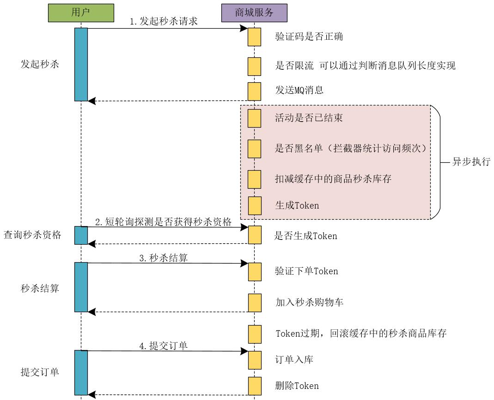

# 限流
限流相关算法
```
```
令牌算法原理
```
```
令牌实现思路
```

```

# 分布式系统幂等性
token 机制
```
用户访问界面时，调用服务端获取token
服务端将token保存到redis里
用户提交表单时，带上token
服务端处理表单时，删除token(如果redis里有这个token，删除时会返回1，否则会返回0)
根据删除结果返回1，则继续处理
否则重复提交
```
status或version机制
```
原理都是 update 时加个where条件，如：
update table set aa='aa',status=2 where id=1 and status=1
```
唯一键机制
```
利用数据库唯一键
```
加锁机制
```
即获取锁后，再往下处理
```
# mysql 读写分离，保证能读到
A写请求操作到主库，B读请求能读到  
## 方案
服务端缓存标记法
```
(1)写请求时，将id之类的，记录到缓存
(2)读的时候判断在不在缓存，如果在则直接走主库
(3)缓存过一段时间删除
//缺点
引入缓存，影响吞吐量
缓存单点问题？
```
客户端缓存法
```
(1)写请求完成后，返回一个标识
(2)客户端读的时候，带上标识
(3)服务端判断标识是否走主库
//缺点
与客户端偶合
```
兜底方案
```
(1)都从从库读
(2)如果从库读不到，则到主库读
//缺点
攻击风险
```
GTID方案
```
(1)主从复制使用GTID
(2)从库查询，可以使用 select wait_for_executed_gtid_set(gtid_set, timeout); 等待GTID
```
# 秒杀系统
特点：读多写少、瞬时并发量很大
解决思路：将并发请求尽量拦截到前面，越往后，并发越少
```c
//部署思路
流量隔离、服务隔离、数据库隔离
//前端
前端静态，cdn分发，按钮灰色
//后端
登陆用户、判断MQ大小、过滤重复、写入MQ
异步从MQ处理请求、前端定时获取token
用户下单:验证码，验证token、加入购物车
用户结算：删除token、从数据库中减少商品
过期未结算：后台判断，如果有则回到库存，可再次提供用户抢
```
[参考文章](https://developer.aliyun.com/article/791806)
## 大体架构图(根据业务进行灵活调整)

## 注意问题
### 非法用户
同一用户多次请求
```c
//目标
只有一次请求能成功
//限制思路
处理请求前，先判断用户是否已有请求
为了高性能：可以先判断本地缓存，然后再判断redis缓存，本地缓存后台
```
同一ip多个用户请求
```c
//思路
设置同一个ip允许的请求数，超过时，弹出验证码界面
```
多个账号、不同ip请求
```c
和真正用户几乎无差别了
//目标
预防“僵尸账号”
//思路
提前加载一些僵尸账号id到缓存，处理请求时，判断是否是僵尸账号
```
### 削峰
```
(1)处理请求前，先判断队列大小,如果队列已满，则直接返回“商品已被抢完”
(2)请求加入到消息队列
(3)后台异步处理请求
```
### 数据安全、超卖问题
```
(1)根据削峰，已径拦截了大量请求
(2)更新sql语句，要带上数量, update table set count = count-1 where count>0
(3)只有更新成功，用户才算真正抢到商品
```
### 限流
```c
为了整体安全，可以加入全局限流，如用户一秒最多访问一次
//用户频繁查询token场景
根据用户id限流，如1秒只能允许一次
//恶意用户直接访问下单url场景
下单界面要带上token(也算动态url了)，真正下单时，验证token合法性
```
# 服务高可用
Keepalived
```c
//四层协议、最少两台服务，虚拟ip
Keepalived 集群软件是一个基于VRRP协议来实现的LVS(四层协议)服务高可用方案，可以避免单节点故障。LVS服务需要有2台服务器运行
Keepalived服务，一台为主服务器(MASTER)，一台为备份服务器(BACKUP)，但是对外只有一个虚拟IP，主服务器会发送特定的消息给备份
服务器，当备份服务器收不到这个消息的时候，备份服务器认为主服务器宕机并会接管虚拟IP提供服务，从而保证了服务的高可用性。
```
nginx upstream
```c
backup
upstream jh.w3cschool.cn {
    server 192.168.80.121:80 weight=3;//权重，ip_hash,响应时间等
    server 192.168.80.122:80 weight=2;
    server 192.168.80.123:80 backup;
}
```