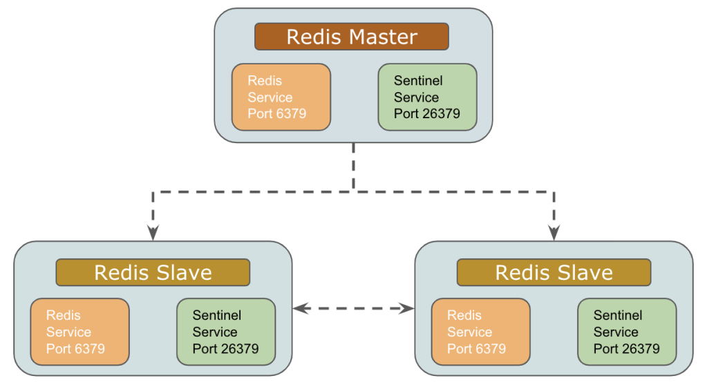
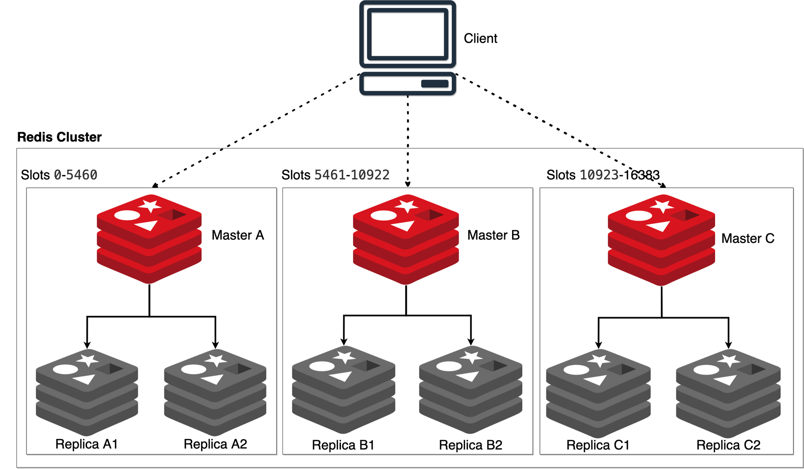

# 面试
[源文](https://www.xiaolincoding.com/redis/base/redis_interview.html)
## redis简介
```
redis是一个内存数据库，读写操作都在内存完成，因此速度非常快，常用于缓存、分布式锁等场景
redis提供string、hash、list、set等常用数据类型
除此外redis还支持事务、lua脚本
还支持将数据持久化到磁盘
支持主从、哨兵等集群模式
```
## redis为什么这么快？
```
(1)redis 的大部分操作都在内存完成
(2)redis采用单线程模型避免了多线程之间的竞争，省去了多线程上下文切换
(3)redis使用io多路复用
```


## redis集群
### 主从模式
同步原理
```
第一次同步，用replicaof命令：
(1)主从建立连接
(2)主准备RDB，并发送给从节点
(3)从节点接收及加载RDB，加载完RDB后ACK主节点
```
第一次同步期间，主有处理写命令如何处理
```c
主会将写命令记录到buffer里
当收到从节点ACK后，再buffer的写命令发送给从节点
//注意：之后同步都只是发送写命令
```
优缺点
```c
优点：有数据备份安全、提高了读能力
缺点：master发生故障需手动切换
//注意在从节点，不会判断key是否过期，从节点过期key处理，依赖于主节点，主节点如果删除了过期key，会发送一条del指令到从节点
```
### 哨兵模式

```
优点：在主从模式的基本上，实现了master故障自动切换，解决了高可用问题
缺点：性能及容量局现于单机
//注意：sentinel 是一个单独的进程，一般和redis同一台机器
```
#### 集群脑裂
```
当主机点与从节点网络有问题时，就会出现两个主节点的情况，即集群脑裂。
```
集群脑裂会导致什么问题？
```c
//min-slaves-to-write、min-slaves-max-lag
如果没有配置这两个参数或都这两个参数设置不合理，就会导致客户端向旧主节点写入数据丢失。
这两个参数的意义是控制主从同步数据的状态，如果有问题，就拒绝客户端写的请求。
min-slaves-to-write:主必须要有x个从连接点，如果少于拒绝写请求
min-slaves-max-lag：当主从复制数据超过x时间，就拒绝写请求
```
### cluster模式

原理
```
redis集群分16384个槽点，每个集群节点负责一部分槽点；
槽点根据crc16(key)%16384得出
```
客户端
```c
客户端与redis直连，哪访问某个key不存在这个节点时，会返回 moved命令，告诉客户端正确的路由信息
//注意客户端会缓存集群槽的情况，当请求时也会算crc16(key)/16384。如果集群有变更，客户端可以发送 CLUSTER SLOTS 指令更新槽的情况
```
## redis过期删除策略
惰性删除+定期删除  
惰性删除
```
redis使用一个dict存储设置了过期时间的key，当客户端请求key的时候，判断key是否过期，如果过期了则删除key+返回null值
//优点：对cpu友好 
//缺点：对内存不友好
```
定期删除
```
(1)redis定期(默认10秒)随机从过期字典中随机抽取20个key，判断是否过期
(2)如果这次的抽取过期率超过25%那么继续下一次抽取
(3)如果随机抽取删除的操作耗时超过25ms，那会跳出本次检查
```
## 内存淘汰策略
是指如果redis使用的内存超过了上限，采取的措施。（注意redis 在64位默认不设置上限的）
```
可以分为三类：不处理，对设置过期key进行淘汰，对所有key进行淘汰
```
### 不处理
```c
redis3.0之后默认的策略 //noeviction
在此策略下，如果内存超过了上限，则所有写操作都会失败，读操作正常
```
### 设置过期key+所有key淘汰
这两种淘汰都差不多，[细节看](https://xiaolincoding.com/redis/module/strategy.html#%E5%86%85%E5%AD%98%E6%B7%98%E6%B1%B0%E7%AD%96%E7%95%A5)

### lru与lfu
lru
```
最近最少使用：按访问时间排序，时间越久的先被淘汰。
```
但lru算法有个bug
```
例如缓存大小为3，现有A,B,C三个元素，A和B被访问的次数都很多，突然C被访问了下，碰巧这时又要插入一个D，这时A或B会被淘汰掉。
```
#### redis 的lru算法
传统实现lru算法
```
需要维护一个有序链表，当元素被访问的时候，把元素移动表头，当要淘汰的时候就从表尾直接删除元素
```
redis的lru算法
```c
//传统的实现，有两个问题
(1)需要额外维护一个大链表
(2)每次访问需要移动元素
//redis实现类似lru算法
(1)元素增加一个字段保留最近访问时间
(2)当发现淘汰时，随机抽取N个元素，然后访问时间越久的，就淘汰掉
```
#### lfu
最近最不常用：按访问频率排序，频率越低的，先被淘汰掉

## redis设置key ttl总结
```
(1)内存淘汰策略，可以指定淘汰的范围只是设置了ttl的
(2)淘汰策略，支持lru和lfu等策略
(3)从节点不会主动删除或判断过期key，如果某个key过期了且主节点，没有发del命令过来，那么客户端读取从节点，是能获取到的
```


## redis 实战
### 如何实现延迟队列
延迟队列是指：如在淘宝、京东购物时，超过一段时间未付钱，订单自动取消
```
(1)用redis的有序集合，时间做为排序字段
(2)应用程序，根据当前时间来筛选，如果超时了，就进行删除业务
```


