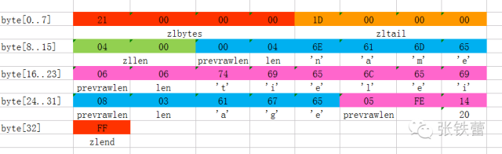
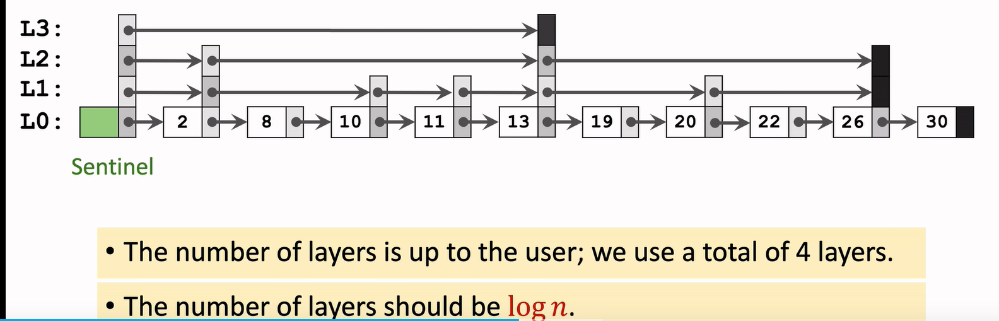

# 内部数据结构
## dict
```
类似hashmap，但有点不同的时，当内部需要扩展空间的时候(旧数据需要迁移)，不是一次迁移完成，而是把迁移分散到多个get、set等操作上，redis将这个步骤称为“增量式重哈希”，目的是提高响应效率
```
## sds
全称是 Simple Dynamic String（简单动态字符串）  
redis 的定义
```c
struct __attribute__ ((__packed__)) sdshdr8 {
    uint8_t len; /* used */
    uint8_t alloc; /* excluding the header and null terminator */
    unsigned char flags; /* 3 lsb of type, 5 unused bits */
    char buf[];
};
//当然还有 unint16、unint32、unint64类型
```
为什么redis，不直接用c语言的字符串类型(char [] + string.h)呢？  
```
(1)c语言获取字符串的长度，需要每次遍历字符串的，效率低
(2)防止字符串拼接溢出：c语言strcat拼接两个字符串，如果长度不够会溢出，而sds的append函数，会判断len，不够时会扩容
(3)减少申请字符串空间的次数：字符串修改操作的时候，会判断len，如果当前buf够用，就不用申请了
```
## robj
全称是redis object
```c
typedef struct redisObject {
    unsigned type:4;       // 数据类型  integer  string  list  set
    unsigned encoding:4;
    unsigned lru:LRU_BITS; /* LRU time (relative to global lru_clock) or
                            * LFU data (least significant 8 bits frequency
                            * and most significant 16 bits access time). 
                            * redis用24个位来保存LRU和LFU的信息，当使用LRU时保存上次
                            * 读写的时间戳(秒),使用LFU时保存上次时间戳(16位 min级) 保存近似统计数8位 */
    int refcount;          // 引用计数 
    void *ptr;              // 指针指向具体存储的值，类型用type区分
} robj;
```
## ziplist
ziplist是一个特殊的双向链表，用一块连续空间来表示双向链接，如
```xml
<zlbytes><zltail><zllen><entry>...<entry><zlend>


zlbytes：表示总共占用多少字节
zltail：表示最后元素在ziplist的偏移字节数，从而可以在末端push,pop
zllen：表示总共有多少个元素，大小只有16bit，从而最多可以表示2^16个元素，可以超过了，就需要从头遍历到尾才知道共有多少元素
entry的结构:<prevrawlen><len><data>
    prevrawlen:表示前一个元素的字节数
    len：当前字节数
    data:真正数据内容
zlend：结束标识
```
主要目的
```c
节省内存空间：
(1)没有维护pre,next指针 （每个指针长度8字节）
(2)紧凑行内存分配，不会产生大量内存垃圾碎片
(3)整数使用二进制存储的(int大小为2或4字节)
//1字节(byte)=8bit
```
充分体现了redis对存储空间的极致要求，存储样例

### ziplist与hash
当hash的key-val 数量比较少时，底层就是用ziplist来存储的，如果key-val的数量 或 val 的值超过这两个配置，那么hash的底层就会转会dict来存储
```
hash-max-ziplist-entries 512
hash-max-ziplist-value 64
```
## quicklist
对应的就是redis list数据类型(类似golang的切片)，支持向头部和尾部增加、删除元素，且这些操作都是O(1)复杂度
```c
//O(1)复杂度
lpush、lpop、rpush、rpop
//O(N)复杂度，任意中间位置的存取操作
lindex、linsert
```
### 底层结构
```
双向链表+ziplist，节点是ziplist  
```
为什么要这样设计？
```
(1)如果是只是双向链表，会产生很多的内存碎片
(2)如果只是用类似sds结构来表示，会有扩容时拷贝问题
综上所述，用双向链表可以解决扩容时拷贝问题、用ziplist可以尽量减少内存碎片问题
```

## sorted set
redis的有序集合，例子
```c
//ranking 集合名称 80分数，a 是名字
redis 127.0.0.1:6379> ZADD ranking 80 a
(integer) 1
redis 127.0.0.1:6379> ZADD ranking 90 b
(integer) 1
redis 127.0.0.1:6379> ZADD ranking 85 c
(integer) 1

//常用指令
查询某个同学的排名， zrevrank ranking b 
    根据b去dict，查到分数后，再去skiplist查对应的排名
查询某个同学的分数，zscore ranking b
    直接查dict即可
查询0~2排名的同学，zrevrange ranking 0 2
    直接查skiplist
查询分数范围内的同学， zrevrangebyscore ranking 80~90
    直接查skiplist
//详细指令 https://www.runoob.com/redis/redis-sorted-sets.html
```
当数据比较少时，sorted是由ziplist实现的，当数据比较多时，则由skiplist+dict实现，具体可以根据配置控制
```c
zset-max-ziplist-entries 128 //当sorted set的元素大于128个时，转为skiplist+dict
zset-max-ziplist-value 64 //当数据项(例子中的名字)大于64个字节时，转为skiplist+dict
```
### skiplist 原理
首先是一个有序的链表，但在有序链表上操作的复杂度都是O(n)，如果能像有序数组那样用二分查找就好了(引出level)
即skiplist是[有序链表+level构成](https://www.bilibili.com/video/BV1tK4y1X7de/?spm_id_from=333.337.search-card.all.click&vd_source=8db508e686bc7c5ece7e6b27eabf33e5)


```
构造过程从L1层开始(有多少层是一有个算法的，最好是log n层，这样能保证插入和查找都是log n，n代表链表长度)  
查找过程从L3层开始  
```
构造过程
```
(1)首先是一个有序链表
(2)最好构造log n 层(n代表链表长度，这样能保证插入和查找都是log n复杂度)
(3)n 层是构造在n-1层之上，以此类推
(4)每一层保存的是node的地址
```
查找过程
```
(1)从n层开始向下找，直到0层或层的节点的值就是要查找的值
(1.1)如果层的节点值刚好是查找的值，则返回
(1.2)如果到0层，则一个一个对比（从层的开始节点开始对比，不用从链表头开始）
```
插入过程
```
(1)基于查找过程，但会多一张表，记录经过层的开始节点
(2)当插入到对应地址后，根据抛硬币决定当前节点是否增长层
(3)假设新插入的节点要增长层，则根据表，更新层的关系
```
### 都是有序集合，skiplist与平衡树有什么优点
```
实现比较简单
节省空间，
    平衡树每个节点有前后指针，而skiplist约1.33个指针
```
## HyperLogLog
HyperLogLog是一种算法，典行的场景，用于统计日活、月活等，如统计google主页的日活  
//注意：不能拿到某个用户当天的访问次数
```c
//redis的hyperloglog只支持三个命令
PFADD key [element [element ...]]
PFCOUNT key [key ...]
PFMERGE destkey sourcekey [sourcekey ...]
```
[详细介绍](https://juejin.cn/post/7158403890826706981)

## 集合
```c
集合是无序的，在数学上有 交集、并集、差集
    交集：两个集合共有的元素
    并集：两个集合相加
    差集：集合1 减去 集合2，元素不存在集合2的元素
redis 集合添加元素
    sadd s1 13 5 32768 10 100000 a b
    sadd s2 11 b 14 100000
redis 集合内部结构
    当元素较少且都是整形时，用intset存储，否则用dict存储
    当用intset存储时，内部是有序的，查找时用二分查找算法
    用s1添加元素说明下，内部存储结构的变化：
        当添加13 5 内部用intset存储，且每个元素只占用2字节
        当添加 32768后 时，内部要升级，intset每个元素要占用3字节
        当添加a 后，内部会升级为dict
intset结构
    typedef struct intset {
        uint32_t encoding;//contents每个元素占用大小
        uint32_t length;//元素个数
        int8_t contents[];//柔和数组，一个元素可能由多个组成，如contents[0]+contents[1]组成一个元素
    } intset;
redis 实现 并集，交集，差集
    并没有什么特别的算法
    但有一些小技巧，如查找元素时，如果要找的元素的编码大于集合编码时，则直接返回不存在
intset 与 ziplist
    都是用一块连续内存表示
    intset所有元素用统一编码，而ziplist是每个元素编码
```