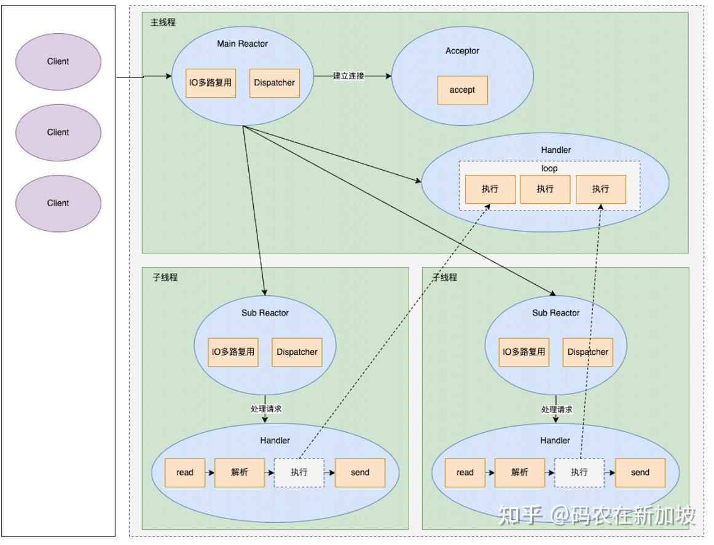

# redis是单线程吗？
```
redis单线程是指处理用户发的命令这一流程是单线程[接收命令-->解析命令-->处理-->发送结果]，称为redis 主线程 
除了主线程外，还有持久化线程、lazyfree线程(4.0后增加)
```
# redis6.0后为什么引用多线程？
[原理](https://zhuanlan.zhihu.com/p/452981967)

```
redis的瓶颈并不是cpu，而更多的是内存和网络io,所以单线程并没有什么问题。  
6.0之后引入的是多个线程处理网络io，默认只开启了发送数据多线程，接收处理请求没有开启(真正处理命令还是单线程的)  
```
## 接收命令开启多线程
```c
//读请求也使用io多线程
io-threads-do-reads yes 
// io-threads N，表示启用 N-1 个 I/O 多线程（主线程也算一个 I/O 线程）
io-threads 4
```