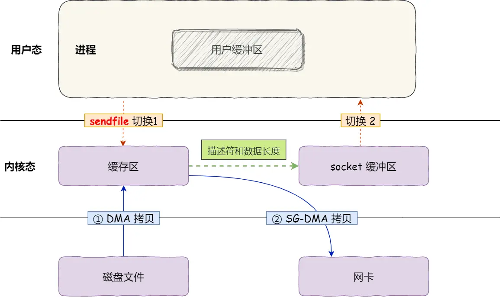

# 零拷贝技术
什么是DMA技术？(Direct Memory Access)
```c
//没有DMA时，CPU负责从磁盘拷贝数据
cpu-->磁盘-->cpu-->pagecache
//有DMA时，DMA负责拷贝数据
cpu-->DMA-->磁盘--DMA-->pagecache
```
零拷贝技术原理
```c
//发送文件场景，没有使用零拷贝
(1)cpu-->DMA-->pagecache-->用户空间
(2)用户空间-->socket缓冲区-->DMA-->网卡
//发送文件场景，使用零拷贝（数据不用到用户空间）
(1)cpu-->DMA-->pagecache
(2)pagecache-->socket缓存区-->网卡
```
## 实现零拷贝方式
mmap+write
```c
//即将内核空间与用户空间做一个映射
//需要调两次内核方法：read+write
(1)cpu-->DMA-->映射空间
(2)映射空间-->socket缓冲区-->DMA-->网卡
```
sendfile
```c
//只调一次内核方法：sendfile
(1)cpu-->DMA-->pagecache
(2)pagecache-->socket缓冲区-->DMA-->网卡
//
```
## 如果网卡支持SG-DMA，sendfile会更先进  


## 发送大文件
```c
//背景
sendfile需要使用到pagecache，如果发送大文件也使用sendfile的话，那么容易占用完系统资源
//aio
aio能绕过pagecache
```


## 背景
早期网络上发送文件，需要调read和write来完成，但这里涉及了四次上下文切换和四次拷贝
```c
//四次上下文
调read时，有两次上下文切换，用户态-->内核态，内核太-->用户态
调write时，有两次上下文切换，用户态-->内核态，内核太-->用户态
//四次拷贝
调read时，磁盘拷贝到pagecache,pagecache拷贝到用户态
调write时，用户态拷贝到socket缓存区，socket缓存
```