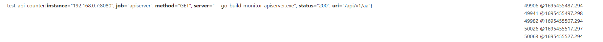
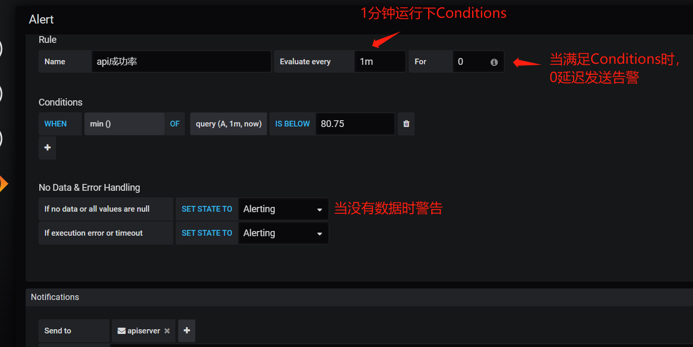

# 监控与报错
```
(1)梳理分类错误码
(2)收集相关指针到prometheus
(3)promethues设置报警
(4)实现报警服务，适配企业微信等
```
## metricsdserver
```
（1）watch() etcd 服务列表
（2）将服务列表写到文件里
（3）prometheus target配置这个文件
```
# prometheus
## rate函数

```
用 最后一个减去第一个，求平均每秒有多少个？，如下
(50063-49906)/(1695455527.294-1695455487.294)
```

## irate函数

```
用 最后一个减去倒数第二，求平均每秒有多少个？，如下
(50063-50026)/(1695455527.294-1695455487.294)
```
## increase

```
增量：求出rate*时间差
((50063-50026)/(1695455527.294-1695455487.294)) * (1695455527.294-1695455487.294)
```
[详细看](https://lotabout.me/2019/QQA-Why-Prometheus-increase-return-float/)
## detal

```
求区间内的差值，最后一个减去第一个
50063-50026
```
## 其他函数
[详细看](https://prometheus.fuckcloudnative.io/di-san-zhang-prometheus/di-4-jie-cha-xun/functions)

# grafana
## alert 告警模块


# ELK 日志系统
```
Elasticsearch
Logstash(java 写的比较耗资源，如果不进行日志加工处理，直接用go写的filebeat)
Kibana

Logstash可以将text格式日志转换为json(原理 支持多个插件进行过滤，插件里支持正则表达式提取)
Elasticsearch 可以统计某个关键词数量（https://segmentfault.com/q/1010000020268732）
```
