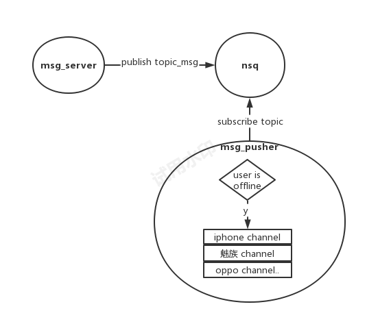

```
发送消息-->接收消息、离线消息
群，群权限
语音、视频通话
统一工作台
    集成第三方系统
组织架构LDP
```

# 发送消息,接收消息


# 消息已读未读
## 存储模型
| msgid  | reader    |
| ------ | --------- |
| msgid1 | gid1,gid2 |
| msgid2 | gid3,gid4 |
## 流程

```
发送消息时，加入回执表(注意 不用标明哪些人要读，即reader一开始为空)
当用户读消息时，更新reader
用tcp通信通知发送者，消息的最新状态
已读/未读状态，让客户端判断
```

# 用户登陆获取消息（包括离线消息）
```
1.http 获取会话窗口
2.http根据会话窗口id，获取最新消息
//这样设计可以覆盖 离线消息场景(包括用户无网络场景)
```

# 客户端后台运行(或没有运行程序场景)，消息提醒

```
不用管用户是否有网络，只管将消息发送到iphone等
```